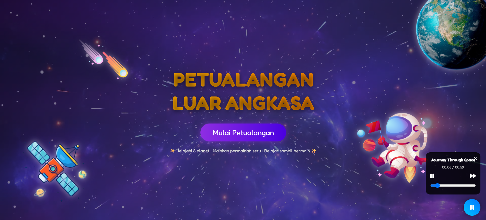
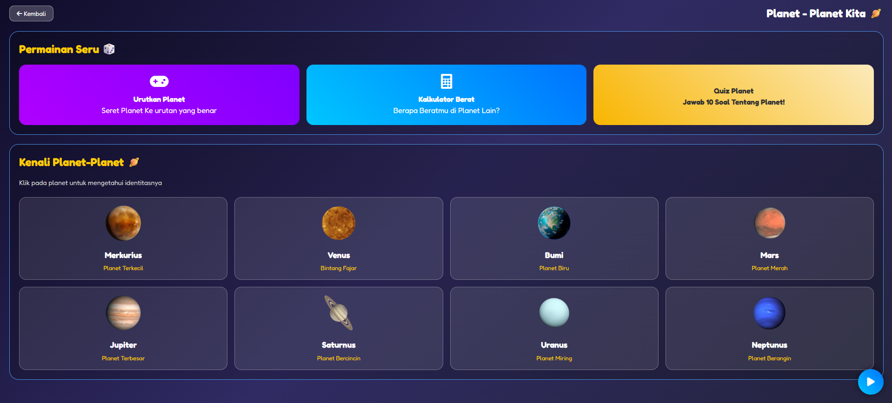
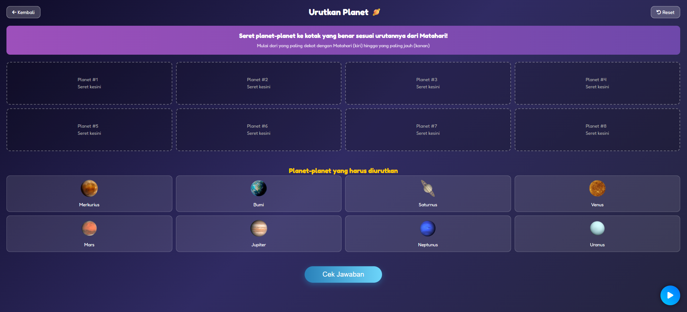
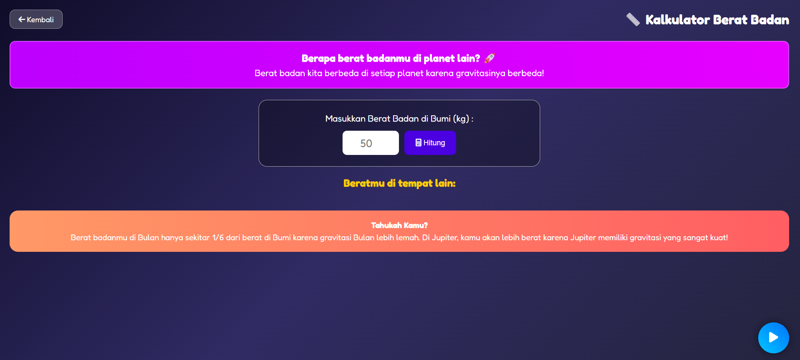
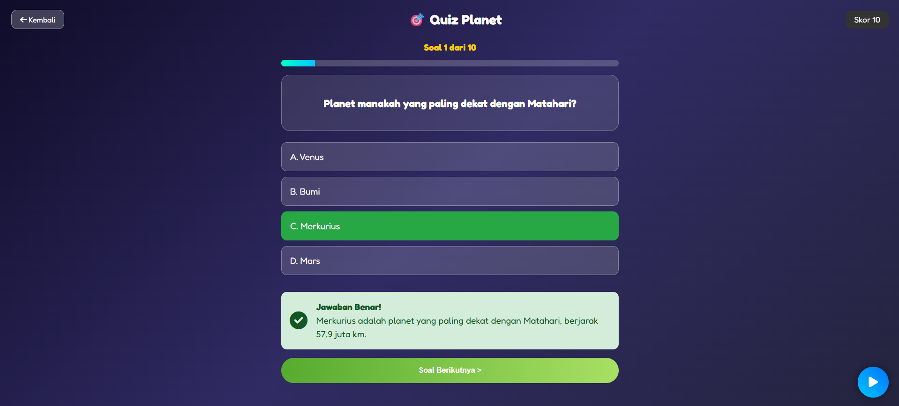
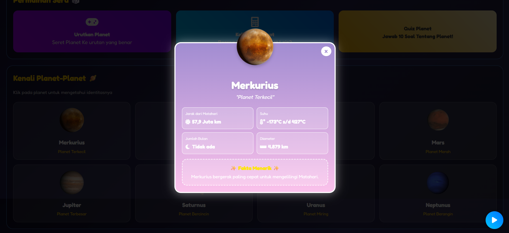

# 🚀 Petualangan Luar Angkasa Anak SD

Website edukasi interaktif bertema luar angkasa yang dibuat untuk membantu anak-anak Sekolah Dasar mengenal **8 planet di Tata Surya** melalui materi, permainan, kalkulator, dan kuis yang menyenangkan.

Proyek ini menggabungkan konsep **belajar sambil bermain (learning through play)** dengan tampilan visual bertema galaksi agar materi tentang Tata Surya lebih menarik dan mudah dipahami oleh anak-anak.

---

## 🌌 Preview Website

### 🏠 Halaman Utama
<p align="center">
  
</p>

### 🪐 Mengenal Planet
<p align="center">
  
</p>

### 🎮 Permainan Urutkan Planet
<p align="center">
  
</p>

### ⚖️ Kalkulator Berat Badan
<p align="center">
  
</p>

### 🎯 Quiz Planet
<p align="center">
  
</p>

### 🔎 Detail Informasi Planet
<p align="center">
  
</p>

---

## 📖 Tentang Website

**Petualangan Luar Angkasa** merupakan website edukasi interaktif yang memperkenalkan 8 planet di Tata Surya:

- ☿️ Merkurius
- ♀️ Venus
- 🌍 Bumi
- ♂️ Mars
- ♃ Jupiter
- ♄ Saturnus
- ♅ Uranus
- ♆ Neptunus

Website dirancang dengan pendekatan visual yang cerah dan interaktif agar anak-anak dapat mempelajari informasi dasar mengenai planet dengan cara yang lebih menyenangkan.

Selain membaca materi, pengguna juga dapat mencoba permainan, menghitung berat badan di planet lain, dan mengerjakan kuis untuk menguji pemahaman.

---

## ✨ Fitur Utama

### 1. 🪐 Mengenal Planet

Pengguna dapat memilih salah satu dari 8 planet untuk melihat informasi mengenai planet tersebut.

Informasi yang tersedia meliputi:

- Nama planet
- Karakteristik singkat
- Jarak dari Matahari
- Suhu
- Jumlah bulan
- Diameter
- Fakta menarik

Informasi ditampilkan melalui **modal interaktif**, sehingga pengguna dapat membuka dan menutup detail planet tanpa berpindah halaman.

### 2. 🎮 Permainan Urutkan Planet

Permainan untuk melatih pengguna mengurutkan planet berdasarkan jaraknya dari Matahari.

Urutan yang benar:

**Merkurius → Venus → Bumi → Mars → Jupiter → Saturnus → Uranus → Neptunus**

Pengguna menyusun planet pada kotak yang tersedia kemudian menekan tombol **"Cek Jawaban"** untuk mengetahui hasilnya.

### 3. ⚖️ Kalkulator Berat Badan

Pengguna dapat memasukkan berat badan di Bumi untuk mengetahui perkiraan beratnya jika berada di planet lain.

Contoh:

> Berat di Bumi: 50 kg

Sistem kemudian menghitung berat berdasarkan perbedaan gravitasi setiap planet.

Fitur ini membantu memperkenalkan konsep bahwa **gravitasi setiap planet berbeda**.

### 4. 🎯 Quiz Planet

Kuis interaktif yang terdiri dari **10 soal** mengenai planet dan Tata Surya.

Fitur kuis:

- 10 pertanyaan
- Pilihan jawaban
- Sistem skor
- Progress bar
- Indikator nomor soal
- Informasi benar/salah
- Penjelasan jawaban

### 5. 🎵 Musik / Suara Latar

Website dilengkapi musik latar bertema luar angkasa untuk membuat pengalaman belajar lebih menarik.

Pengguna dapat mengontrol musik menggunakan tombol yang tersedia pada halaman.

### 6. 🌠 Tampilan Interaktif

Desain website menggunakan tema luar angkasa dengan berbagai elemen visual:

- Background galaksi
- Ilustrasi planet
- Astronaut
- Meteor
- Satelit
- Animasi
- Tombol interaktif
- Modal informasi
- Warna cerah dan ramah anak

---

## 🛠️ Teknologi yang Digunakan

| Teknologi | Penggunaan |
|---|---|
| **HTML5** | Struktur dan konten halaman |
| **CSS3** | Layout, desain, animasi, dan responsive design |
| **JavaScript** | Interaksi, permainan, kalkulator, dan sistem kuis |
| **Git** | Version control |
| **GitHub** | Repository dan pengelolaan source code |
| **Git LFS** | Penyimpanan file video berukuran besar |

---

## 📁 Struktur Folder

```text
Web-Petualangan-Luar-Angkasa-Anak-SD/
│
├── Music/
│   └── File musik website
│
├── picture/
│   ├── Gambar planet
│   ├── Ilustrasi
│   └── Galaxy.mp4
│
├── index.html
├── script.js
├── style.css
├── README.md
├── LICENSE
└── .gitattributes
```

> Folder `screenshots/` pada README ini berisi gambar preview untuk dokumentasi repository. Jika ingin menyertakan screenshot di repository utama, salin folder tersebut ke repository.

---

## ▶️ Cara Menjalankan

### Menjalankan secara lokal

1. Clone repository.
2. Masuk ke folder project.
3. Buka `index.html` menggunakan browser.

Contoh:

```bash
git clone https://github.com/USERNAME/NAMA-REPOSITORY.git
cd NAMA-REPOSITORY
```

Kemudian buka `index.html` di browser.

Karena website menggunakan HTML, CSS, dan JavaScript, website dapat dijalankan langsung tanpa server backend.

---

## 🎓 Tujuan Proyek

Proyek ini dibuat sebagai media pembelajaran interaktif untuk:

- Mengenalkan planet-planet di Tata Surya kepada anak SD.
- Membantu anak memahami karakteristik dasar setiap planet.
- Menggabungkan materi pembelajaran dengan permainan.
- Meningkatkan keterlibatan pengguna melalui kuis dan interaksi.
- Menerapkan HTML, CSS, dan JavaScript dalam sebuah website edukasi.

---

## 👦 Target Pengguna

Website ditujukan terutama untuk:

- Anak-anak Sekolah Dasar.
- Guru atau orang tua sebagai media pembelajaran tambahan.
- Pengguna yang ingin mempelajari dasar-dasar Tata Surya secara interaktif.

---

## 📌 Status Project

**Status:** ✅ Selesai / Siap dipublikasikan

Fitur utama yang tersedia:

- [x] Materi 8 planet
- [x] Detail informasi planet
- [x] Permainan urutkan planet
- [x] Kalkulator berat badan
- [x] Quiz 10 soal
- [x] Sistem skor
- [x] Musik latar
- [x] Tampilan responsif
- [x] Dokumentasi README

---

## 💡 Pengembangan Selanjutnya

Beberapa fitur yang dapat dikembangkan pada versi berikutnya:

- 🌍 Animasi orbit planet yang lebih interaktif.
- 🏆 Sistem achievement atau badge.
- ⭐ Sistem poin dan reward.
- 🔊 Narasi suara untuk materi planet.
- 📱 Optimasi tampilan untuk perangkat mobile.
- 💾 Penyimpanan progress belajar pengguna.
- 🌙 Mode malam/siang.
- 🧩 Permainan edukasi tambahan.
- 📝 Penambahan materi tentang Matahari, Bulan, asteroid, dan komet.

---

## 📷 Dokumentasi

Screenshot pada bagian **Preview Website** digunakan untuk memberikan gambaran tampilan dan fitur utama website sebelum pengguna menjalankan project.

---

## 📄 Lisensi

Project ini menggunakan lisensi yang tercantum pada file [`LICENSE`](LICENSE).

---

## 👨‍💻 Author

**Fakhriy**

Project: **Petualangan Luar Angkasa Anak SD**

Dibuat sebagai project website edukasi interaktif berbasis HTML, CSS, dan JavaScript.

